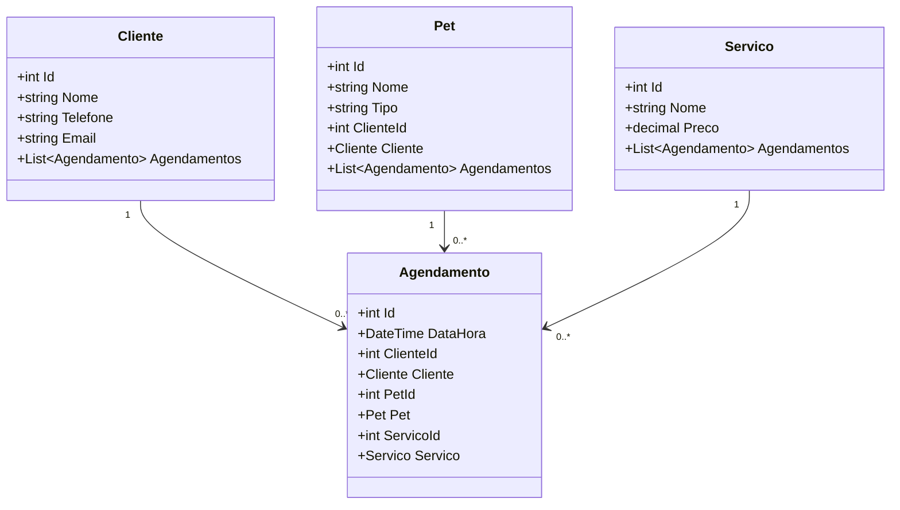

# Sistema de Agendamento de Banho e Tosa - UAU Dog - MVC API em C#

## Visão Geral do Projeto
O **Sistema de Agendamento de Banho e Tosa** foi desenvolvido para atender às necessidades do **UAU Dog**, um pet shop que oferece serviços de banho, tosa e clínica veterinária. O objetivo principal deste sistema é automatizar o agendamento de serviços para melhorar a organização e eficiência, além de registrar históricos de clientes e pets.

O projeto foi estruturado de forma modular, permitindo fácil manutenção e expansão. No futuro, a API poderá ser estendida para abranger outros serviços veterinários, como vacinação, consultas e tratamentos especializados.

## Funcionalidades

1. **Cadastro de Clientes**: Gerencia informações dos clientes, como nome, telefone e endereço.
  > - **Clientes**: Cadastro, consulta, edição e exclusão de clientes.
2. **Cadastro de Pets**: Registra animais de estimação, incluindo dados como nome, tipo de animal (ex: cão, gato) e associação com o dono.
  > - **Pets**: Cadastro, consulta, edição e exclusão de pets associados a clientes.
3. **Gerenciamento de Serviços**: Define serviços oferecidos, incluindo nome e preço.
  > - **Serviços**: Listagem de serviços oferecidos (banho, tosa, etc.).
4. **Agendamento de Serviços**: Cria, consulta, atualiza e exclui agendamentos, permitindo que clientes escolham o serviço desejado, associem o animal e selecionem a data/hora.
  > - **Agendamentos**: Criação, listagem, edição e exclusão de agendamentos para serviços.

## Estrutura de Arquivos e Pastas

A estrutura principal do projeto é baseada no padrão MVC, com uma API mínima em C#. Os componentes principais são:
[Em planejamento pode ser alterado a qualquer momento]
```
📂 ProjetoRaiz 
  ├── 📂 Models # Classes que representam as entidades (Cliente, Animal, Servico, Agendamento) 
  ├── 📂 Data # Classe DbContext que mapeia as Classes de Model para o Banco de dados (EF + Banco Postgres [NpgSql.EntityFrameWorkCore.PostgreSql]) 
  ├── 📂 Services # Lógica de negócios para cada entidade 
  ├── 📂 Controllers # Mapeamento dos endpoints para CRUD
  ├── 📂 Migrations # Arquivos de migração do Entity Framework para banco Postgres AIVEN 
  └── Program.cs # Configuração da API e mapeamento de endpoints (pode mudar)
```

---

## Estrutura do Projeto
A estrutura do projeto foi projetada seguindo boas práticas de separação de responsabilidades:

- **Controller**: Controladores que gerenciam as rotas e a lógica das APIs.
  - `AgendamentoController.cs`: Gerencia os endpoints relacionados a agendamentos.
  - `ClienteController.cs`: Gerencia os endpoints relacionados a clientes.
  - `PetController.cs`: Gerencia os endpoints relacionados a pets.
  - `ServicoController.cs`: Gerencia os endpoints relacionados aos serviços.

- **Data**:
  - `AppDbContext.cs`: Classe de contexto que configura o Entity Framework e os mapeamentos para o banco de dados PostgreSQL.

- **Migrations**:
  - Armazena os arquivos de migração do Entity Framework.

- **Model**:
  - Contém as classes de domínio que representam os dados da aplicação:
    - `Agendamento.cs`
    - `Cliente.cs`
    - `Pet.cs`
    - `Servico.cs`

- **Services**:
  - Serviços responsáveis pela lógica de negócio:
    - `AgendamentoServ.cs`: Lida com a lógica de agendamentos.
    - `ClienteServ.cs`: Gerencia operações relacionadas a clientes.
    - `PetServ.cs`: Gerencia operações relacionadas a pets.
    - `ServicoServ.cs`: Gerencia operações relacionadas aos serviços.

---

## Tecnologias Utilizadas
- **Framework**: .NET (C#)
- **Banco de Dados**: PostgreSQL (Serviço no AIVEN)
- **ORM**: Entity Framework Core
- **Documentação**: Swagger para API
- **Gerenciamento de Dependências**: Injeção de Dependência (DI) nativa do .NET

### Justificativa
- O **PostgreSQL** foi escolhido por ser uma solução de banco de dados open-source, confiável e escalável, e por ser um serviço gratis de banco online com o AIVEN.
- O uso de **Entity Framework** simplifica o mapeamento objeto-relacional (ORM), tornando o desenvolvimento mais eficiente.

---

## Configuração do Projeto
### Pré-requisitos
- .NET 6 SDK instalado ou superior
- PostgreSQL instalado e configurado

### Configuração do Banco de Dados
1. Configure a **connection string** no arquivo `appsettings.json`:
   ```json
   "ConnectionStrings": {
     "ApiDatabase": "Host=localhost;Database=seuDB;Username=seu_usuario;Password=sua_senha"
   }

## Endpoints da API

A API foi estruturada com os seguintes endpoints principais:

### Clientes

- `GET /Cliente`  
  Retorna todos os clientes.  
- `GET /Cliente/{id}`  
  Retorna um cliente específico.  
- `POST /Cliente`  
  Cria um novo cliente.  
- `PUT /Cliente/{id}`  
  Atualiza um cliente existente.  
- `DELETE /Cliente/{id}`  
  Exclui um cliente.  

---

### Pets

- `GET /Pet`  
  Retorna todos os pets.  
- `GET /Pet/{id}`  
  Retorna um pet específico.  
- `POST /Pet`  
  Cria um novo pet.  
- `PUT /Pet/{id}`  
  Atualiza um pet existente.  
- `DELETE /Pet/{id}`  
  Exclui um pet.  

---

### Serviços

- `GET /Servico`  
  Retorna todos os serviços cadastrados.  

---

### Agendamentos

- `GET /Agendamento`  
  Retorna todos os agendamentos.  
- `GET /Agendamento/{id}`  
  Retorna um agendamento específico.  
- `POST /Agendamento`  
  Cria um novo agendamento.  
- `PUT /Agendamento/{id}`  
  Atualiza um agendamento existente.  
- `DELETE /Agendamento/{id}`  
  Exclui um agendamento.  


### Exemplo de Endpoint (ClienteController)
  ```c#
    [ApiController] //controlador de API
    [Route("[controller]")] // Define a rota base como "/Cliente"
    public class ClienteController : ControllerBase
    {
        private readonly IClienteServ _clienteService;
        public ClienteController(IClienteServ clienteService)
        {
            _clienteService = clienteService;
        }

        // GET: /Cliente (todos os clientes)
        [HttpGet]
        public async Task<IActionResult> GetAllClientes()
        {
            // Chama o serviço para buscar os clientes
            var clientes = await _clienteService.GetAllClientesAsync();

            // Retorna os clientes no formato JSON
            return Ok(clientes);
        }
```
### Diagrama de Classes


# Licença
> Este projeto é licenciado sob a MIT License. Consulte o arquivo LICENSE para mais informações.

